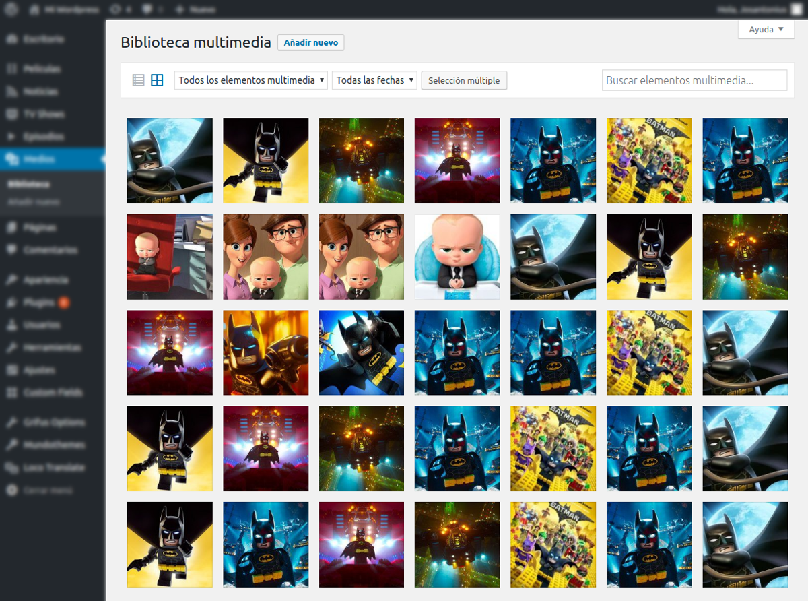
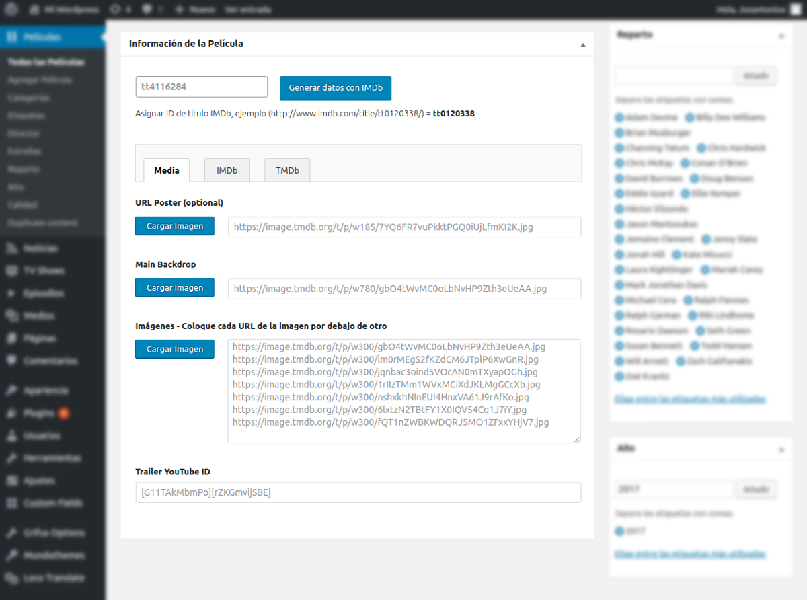
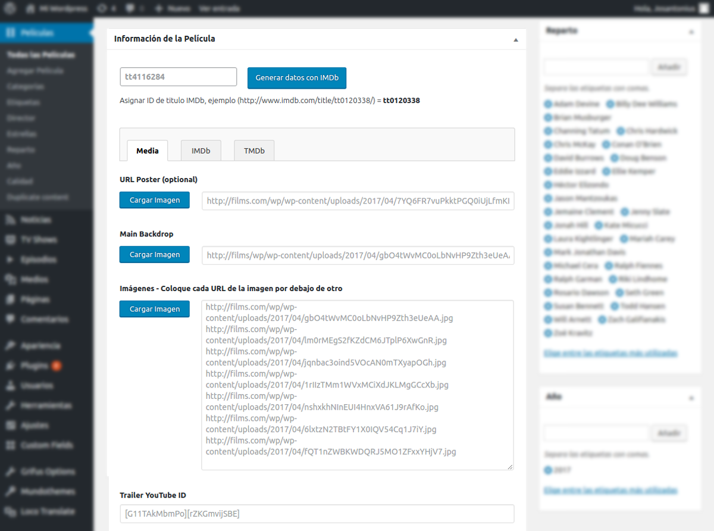
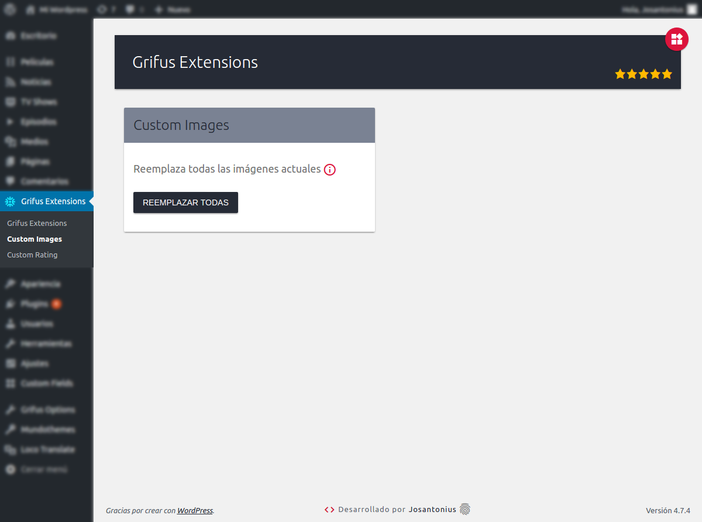
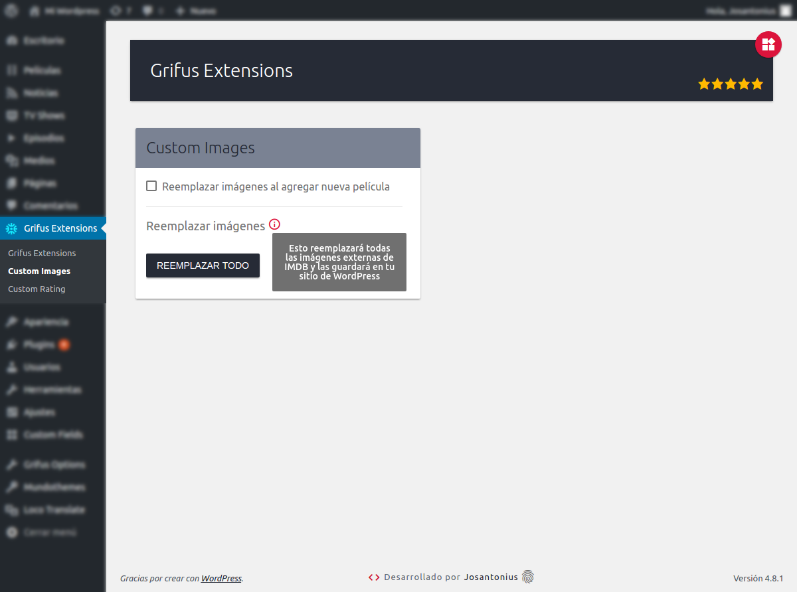
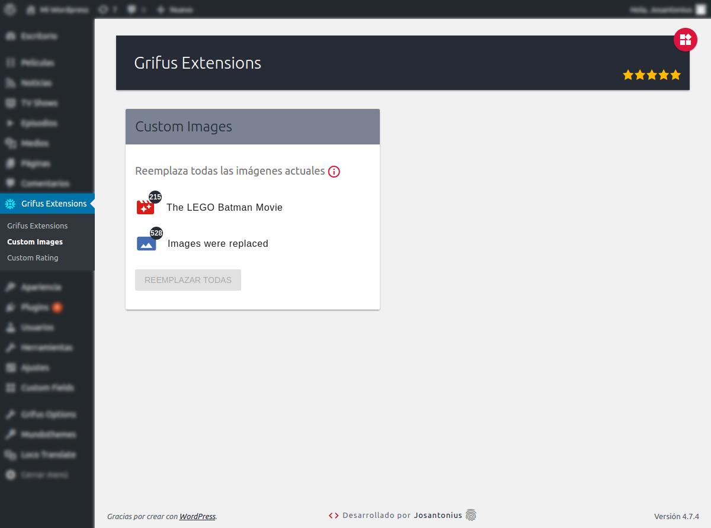
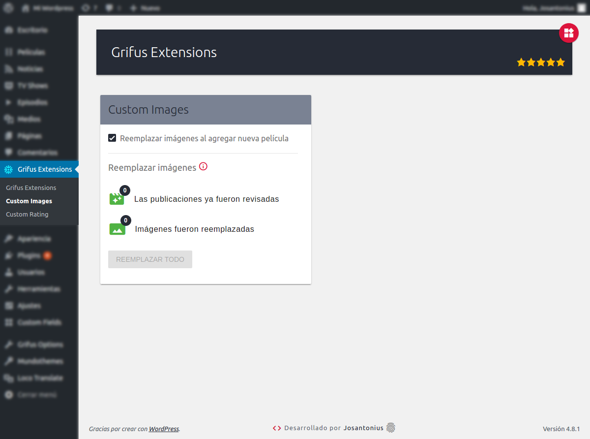

# Extensions For Grifus · Custom Images

       

[Versión en español](README-ES.md)

Custom Images Grifus reemplaza imágenes externas de IMDB y las guarda en tu sitio de WordPress.

---

- [Requisitos](#requisitos)
- [Instalación](#instalación)
- [Imágenes](#imagenes)
- [Tests](#tests)
- [Tareas pendientes](#-tareas-pendientes)
- [Contribuir](#contribuir)
- [Licencia](#licencia)
- [Copyright](#copyright)

---

## Requisitos

Este módulo es soportado por versiones de **PHP 5.6** o superiores y es compatible con versiones de **HHVM 3.0** o superiores.

## Instalación 

Puedes instalar este plugin desde el [repositorio oficial](https://es.wordpress.org/plugins/extensions-for-grifus/) en WordPress.

O instalar este módulo en el plugin desde [Composer](http://getcomposer.org/download/). En la carpeta raíz del plugin Extensions For Grifus ejecuta:

    $ composer require eliasis-framework/custom-images-grifus

## Imágenes

## Tests 

Para ejecutar las [pruebas](tests) necesitarás [Composer](http://getcomposer.org/download/) y seguir los siguientes pasos:

    $ git clone https://github.com/eliasis-framework/custom-images-grifus.git
    
    $ cd custom-images-grifus

    $ composer install

Ejecutar pruebas de estándares de código para [WordPress](https://github.com/WordPress-Coding-Standards/WordPress-Coding-Standards/) con [PHPCS](https://github.com/squizlabs/PHP_CodeSniffer):

    $ composer phpcs

Ejecutar pruebas con [PHP Mess Detector](https://phpmd.org/) para detectar inconsistencias en el estilo de codificación:

    $ composer phpmd

Ejecutar todas las pruebas anteriores:

    $ composer tests

[PHPUnit](https://phpunit.de/): Las pruebas unitarias para esta módulo serán realizadas en el repositorio del [plugin](https://github.com/Josantonius/extensions-for-grifus#tests).

## ☑ Tareas pendientes

- [ ] Añadir nueva funcionalidad.
- [ ] Mejorar documentación.
- [ ] Refactorizar código para las reglas de estilo de código deshabilitadas. Ver [phpmd.xml](phpmd.xml) y [.php_cs.dist](.php_cs.dist).

## Contribuir

Si deseas colaborar, puedes echar un vistazo a la lista de
[issues](https://github.com/eliasis-framework/custom-images-grifus/issues) o [tareas pendientes](#-tareas-pendientes).

**Pull requests**

* [Fork and clone](https://help.github.com/articles/fork-a-repo).
* Ejecuta el comando `composer install` para instalar dependencias.
  Esto también instalará las [dependencias de desarrollo](https://getcomposer.org/doc/03-cli.md#install).
* Ejecuta el comando `composer fix` para estandarizar el código.
* Ejecuta las [pruebas](#tests).
* Crea una nueva rama (**branch**), **commit**, **push** y envíame un
  [pull request](https://help.github.com/articles/using-pull-requests).

## Licencia

Este proyecto está licenciado bajo **licencia GPL-2.0+**. Consulta el archivo [LICENSE](LICENSE) para más información.

## Copyright

2017 -2018 Josantonius, [josantonius.com](https://josantonius.com/)

Si te ha resultado útil, házmelo saber :wink:

Puedes contactarme en [Twitter](https://twitter.com/Josantonius) o a través de mi [correo electrónico](mailto:hello@josantonius.com).
